# API DevOps Demo


> API REST professionnelle déployée automatiquement via un pipeline CI/CD Jenkins sur Kubernetes.

## 🏗️ Architecture

```mermaid
flowchart LR
    Dev(👨‍💻 Développeur) -->|git push| GH(GitHub)
    GH -->|webhook| JK(Jenkins)
    JK -->|npm ci| IN(Install)
    IN -->|eslint| LN(Lint)
    LN -->|jest| TS(Tests)
    TS -->|docker build| DB(Docker Build)
    DB -->|docker push| GR(ghcr.io)
    GR -->|kubectl apply| K8S(Kubernetes K3s)
    K8S -->|2 replicas| AP(🚀 API Live)

    style Dev fill:#4A90D9,color:#fff
    style GH fill:#24292e,color:#fff
    style JK fill:#D33833,color:#fff
    style TS fill:#C21325,color:#fff
    style DB fill:#2496ED,color:#fff
    style GR fill:#24292e,color:#fff
    style K8S fill:#326CE5,color:#fff
    style AP fill:#27AE60,color:#fff
```



## 🛠️ Stack technique

| Composant | Technologie | Rôle |
|---|---|---|
| API REST | Node.js 20 + Express | Serveur HTTP |
| Authentification | JWT + bcrypt | Sécurité |
| Tests | Jest + Supertest | 11 tests, 84% coverage |
| CI/CD | Jenkins Pipeline | Automatisation |
| Containerisation | Docker multi-stage | Packaging |
| Orchestration | Kubernetes K3s | Déploiement |
| Registry | GitHub Container Registry | Stockage images |
| Logs | Winston (JSON structuré) | Observabilité |

## 🔌 Endpoints

| Méthode | Route | Description | Auth |
|---|---|---|---|
| GET | `/api/v1/health` | Health check Kubernetes | ❌ |
| GET | `/api/v1/health/ready` | Readiness probe | ❌ |
| POST | `/api/v1/auth/register` | Créer un compte | ❌ |
| POST | `/api/v1/auth/login` | Login → JWT token | ❌ |
| GET | `/api/v1/users` | Liste utilisateurs | ✅ JWT |
| GET | `/api/v1/users/:id` | Un utilisateur | ✅ JWT |

## 🚀 Lancer en local

```bash
# Installer les dépendances
npm install

# Lancer les tests
npm test

# Démarrer l'API
npm start
```

## 🔄 Pipeline Jenkins
git push
│
├── 📥 Checkout       → Récupération du code
├── 📦 Install        → npm ci
├── 🔍 Lint           → ESLint
├── 🧪 Tests          → Jest (11 tests, 84% coverage)
├── 🐳 Docker Build   → Image multi-stage
├── 📤 Docker Push    → ghcr.io/edem38/api-devops-demo
├── ☸️  Deploy K8s    → Rolling update (2 replicas)
└── ✅ Smoke Test     → Vérification endpoint /health
